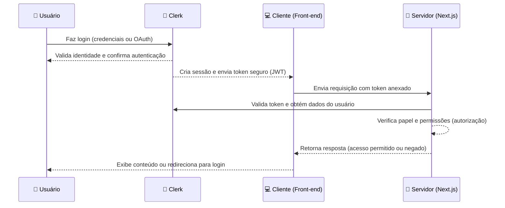

# 🔐 Fluxo de Autenticação e Autorização com Clerk no Next.js

## 📘 O que é o Clerk?

O **Clerk** é uma plataforma moderna de **autenticação e gerenciamento de usuários** para aplicações web.
Ele oferece recursos completos de **login, registro, autenticação com provedores externos (como Google e GitHub)** e **controle de acesso baseado em papéis (roles)**, tudo integrado de forma simples com **Next.js**.

Com o Clerk, o desenvolvedor não precisa criar manualmente sistemas de login, tokens, verificação de sessão ou permissões — tudo isso é gerenciado automaticamente de forma segura e escalável.

---

## 🧭 Visão Geral do Fluxo

O fluxo de funcionamento do Clerk pode ser dividido em **três etapas principais**:

1. **Cliente (Front-end)** — o usuário interage com a interface e realiza o login.
2. **Clerk (Serviço de Autenticação)** — valida a identidade do usuário e cria uma sessão segura.
3. **Servidor (Next.js)** — verifica o token enviado pelo Clerk, valida o papel do usuário e decide o que ele pode acessar.

---

## 🧑‍💻 Etapa 1 — Cliente (Front-end)

* O usuário acessa a aplicação e vê as telas de login, registro ou recuperação de senha fornecidas pelo Clerk.
* Ao fazer login, o Clerk **gera uma sessão segura no navegador**, armazenando um **token JWT (JSON Web Token)**.
* Esse token representa a identidade do usuário autenticado e é **automaticamente anexado às requisições** feitas ao servidor.
* Dessa forma, o cliente nunca precisa lidar diretamente com credenciais ou senhas — tudo é gerenciado de maneira criptografada.

---

## 🏢 Etapa 2 — Clerk (Serviço de Autenticação)

* O Clerk é o **provedor de identidade** responsável por confirmar quem é o usuário.
* Ele verifica as credenciais (login, senha ou autenticação via conta social).
* Após a validação, o Clerk emite um **token JWT** que contém:

  * ID do usuário
  * E-mail
  * Nome
  * Papel (role)
  * Dados públicos adicionais (metadados)
* O Clerk mantém a sessão ativa e garante que apenas usuários autenticados possam acessar áreas protegidas.
* Ele também permite armazenar e consultar **papéis de usuário (roles)**, usados pelo servidor para autorização.

---

## ⚙️ Etapa 3 — Servidor (Next.js)

* O servidor utiliza o **middleware do Clerk** para interceptar todas as requisições.
* Esse middleware verifica automaticamente se o token enviado é válido e se a sessão do usuário ainda está ativa.
* Caso esteja tudo certo, o servidor:

  * Identifica o usuário autenticado;
  * Lê seu papel (role) armazenado no Clerk;
  * Decide se ele tem permissão para acessar aquela rota ou recurso.
* Se o usuário **não estiver autenticado** ou **não tiver permissão**, ele é **redirecionado para a página de login**.

---

## 🔁 Comunicação entre as Partes

| Etapa | Origem    | Destino   | Ação                                     |
| ----- | --------- | --------- | ---------------------------------------- |
| 1️⃣   | Usuário   | Clerk     | Envia credenciais (login, OAuth, etc.)   |
| 2️⃣   | Clerk     | Cliente   | Retorna sessão autenticada e token JWT   |
| 3️⃣   | Cliente   | Servidor  | Envia requisição com token anexado       |
| 4️⃣   | Servidor  | Clerk     | Valida token e obtém dados do usuário    |
| 5️⃣   | Servidor  | Aplicação | Autoriza ou nega o acesso                |
| 6️⃣   | Aplicação | Usuário   | Exibe conteúdo ou redireciona para login |

---

## 📊 Diagrama do Fluxo



---

## 🧩 Papéis e Autorização (Roles)

O Clerk permite definir **papéis (roles)** personalizados para os usuários, como `aluno`, `professor` ou `diretor`.
Esses papéis são armazenados nos **metadados públicos do usuário** e usados pelo servidor para controlar permissões.

Exemplo de hierarquia:

* **Aluno** → pode acessar conteúdo básico.
* **Professor** → pode acessar recursos de aluno e professor.
* **Diretor** → possui acesso restrito a áreas administrativas.

O servidor verifica o papel antes de liberar o acesso, garantindo que cada usuário veja apenas o que lhe é permitido.

---

## O que é JWT?

O **JWT (JSON Web Token)** é um formato seguro e padronizado de token usado para **identificar usuários autenticados** em sistemas web.

Ele é composto por **três partes**:

1. **Header (Cabeçalho)** — indica o tipo de token e o algoritmo de criptografia usado.
2. **Payload (Corpo)** — contém as informações (claims) sobre o usuário, como ID, e-mail ou papel.
3. **Signature (Assinatura)** — garante a integridade do token, impedindo alterações indevidas.

O Clerk usa JWTs para manter a sessão do usuário.
Quando o cliente envia uma requisição ao servidor, o token JWT é verificado:

* Se for **válido**, o acesso é concedido.
* Se for **inválido ou expirado**, o acesso é negado e o usuário precisa se autenticar novamente.

Esse processo garante **autenticação sem necessidade de armazenar sessões no servidor**, mantendo o sistema leve e seguro.

---

### 🧩 Estrutura de um JWT

```mermaid
graph TD
    A[🔐 Header<br/>Tipo + Algoritmo] --> B[📦 Payload<br/>Informações do usuário (claims)]
    B --> C[✍️ Signature<br/>Assinatura digital do token]
    D["JWT = Header.Payload.Signature"] --> A
    D --> B
    D --> C
```

> 🔸 **Exemplo de formato:**
> `xxxxx.yyyyy.zzzzz`
> Cada parte é codificada em Base64 e separada por ponto (`.`).

---

## 🔒 Benefícios do Fluxo Clerk + Next.js

✅ Autenticação completa com poucos passos
✅ Sessões seguras com tokens JWT
✅ Controle de acesso baseado em papéis e permissões
✅ Compatibilidade com login social (Google, GitHub, etc.)
✅ Middleware que protege rotas automaticamente
✅ Armazenamento e gestão de dados de usuário centralizados no Clerk
✅ Experiência de login moderna e personalizável

---

## 🧠 Resumo Simplificado do Processo

```
[Usuário] → faz login → [Clerk] valida identidade
       ↓
[Clerk] → cria sessão e token → [Cliente]
       ↓
[Cliente] → envia requisições → [Servidor]
       ↓
[Servidor] → valida token → verifica papel → concede ou nega acesso
```

